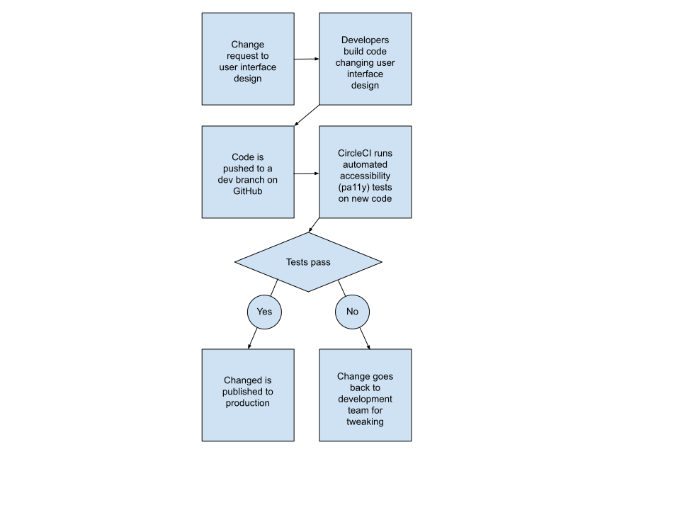

ADA compliance and monitoring for websites
=====

Purpose of this document
-----

* Ensure auditable compliance with ADA standards across all properties as defined by the WCAG 2 standard.
* Prevent changes to the user interface and design elements from breaking compliance.
* Prevent site editors from adding content which breaks compliance.

Compliance with ADA standards
-----

It is proposed that all web properties use a continuous integration (CI) workflow to move code changes from a development, to a staging, to a production environment. Among the necessary steps, the user interface elements are passed through the open-source pa11y tool (pa11y.org) using Circle CI (circleci.com) combined with GitHub (github.com), which stops deployments automatically if changes introduce new issues with ADA compliance.

Please find <a href="https://docs.google.com/drawings/d/1V-Q8U7A4_N42h7ADjjBKuOtIqrfJFJvcjYh8UctCieE/edit">this chart on Google Drawings</a>

<ul>
  <li>First, a change request is made affecitng the user interface design (and thus potentially breaking accessibility)</li>
  <li>Developers build code changing user interface design</li>
  <li>Code is pushed to a dev branch on GitHub</li>
  <li>CircleCI runs automated accessibility (pa11y) tests on new code</li>
  <li>
    <ul>
      <li>If tests pass, the change is published to production</li>
      <li>If tests do not pass, then change goes back to development team for tweaking</li>
    </ul>
  </li>
</ul>

Auditable compliance
-----

Every time new code is introduced into production-ready codebase, CircleCI runs the test suite, including accessibility (pa11y) tests. All tests results (artifacts) are kept for at least a year for auditing purposes.

Limiting non-compliant content added by site editors
-----

On database-powered CMSs like Wordpress or Drupal, content is defined as editor-supplied data which typically resides in the database. For static site generators such as Hugo or Jekyll, the content resides in the code and is treated like code when it comes to testing for accessibility The following approaches are used to limit non-compliant content from being added to sites:

### Training and oversight

All site editors are supervised by a content administrator who has a checklist of common accessibility issues such as:

* Avoiding images which contain text;
* Avoiding images with irrelevant alt text;
* Making sure text is understandable even by non-native English speakers.

### Simplified WYSIWYG data entry

Text formatting is limited to semantically-relevant formats. The following formatting elements are allowed for site editors:

* Lists
* Bold
* Italic
* Hyperlinks

In contrast, formatting elements which do not convey intrinsic semantic meaning are not possible on the system:

* Font color
* Font size
* Table-based formatting
* Images without alt text

In addition to ensuring a consistent design experience, this prevents common accessibility issues, for example, too-small text, or text with insufficient formatting.

### Accessibility guidelines directly on the WYSIWYG in the form

As part of site editor training, have “accessibility guidelines” directly below the wysiwyg form.

Client-facing widgets
-----

The Accessibe ADA or other client-facing widgets can be embedded directly on a website in order to provide non-technical clients with visibility on how accessibility issues are managed. The accessibe widget has the following features:

* Compliance with ADA, AODA, EAA, WCAG & more
* Accessibility statement & certification of performance
* AI-Powered screen reader & keyboard navigation
* Accessibility widget for UI and design remediation
* AI-Powered daily compliance monitoring and scans
* Monthly AI-Powered accessibility compliance audits
* Litigation Support Package
* Priority Support & SLA
* Monthly remediation report with full documentation
* Automatic Google Analytics Integration
* User & Team Management
* Multi-account management
* API & Batch Management

Steps in the accessibility pipeline
-----

* Creatives use contrast-ratio checkers and need to document where design considerations override * automated checks
* HTML / CSS integrators use GitHub combined with CircleCI and a tool such as https://github.com/dcycle/docker-pa11y to automatically check for common accessibility issues in underlying code
* All websites subject to speed checks
* Any changes to code will trigger accessibility checks using GitHub, CircleCI and an automated tool
* Live sites periodically are subject to automated tests
* Manual testing
* Keyboard navigation
* Broken links
* Toggle button automates larger text
